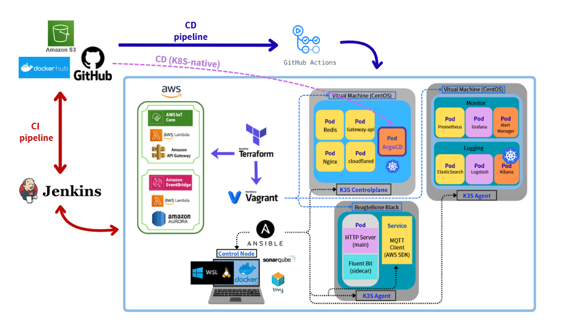

# DevSecOps_with_BBB
 A hybrid edge-to-cloud DevOps architecture integrating K3s, Jenkins, ArgoCD, Terraform, Ansible and AWS IoT Core.

## 📘 Overview
此專案主要目的為在邊緣裝置（BeagleBone Black）與雲端基礎設施之間建立一條端到端的 DevSecOps 流程，包含 CI/CD、自動化佈署、監控、以及安全控制。

---

## 🧱 Architecture

### 🔹 Components
- **CI/CD**：Jenkins + GitHub Actions + ArgoCD
- **Infrastructure**：Terraform + Ansible + Vagrant
- **Monitoring**：Prometheus + Grafana + AlertManager
- **Logging**：Fluent Bit + Logstash + ElasticSearch + Kibana
- **Edge Device**：BeagleBone Black (K3s agent + HTTP server + AWS MQTT Client)
- **Cloud Services**：Cloudflare Tunnel, AWS Lambda, API Gateway, Event Bridge, IoT Core, Aurora Serverless, S3

---

#### 🏗️ Infrastructure
- **Terraform + Ansible + Vagrant**：自動化建置與環境配置
- **K3s Cluster**：輕量化 Kubernetes，部署應用與監控堆疊

#### ⚙️ CI/CD & GitOps
- **Jenkins**：負責 **CI 階段** 的自動化建置與測試流程，生成可部署的 Artifact。當測試通過後，會自動對 **CD Repository** 建立 Pull Request，作為部署審核的觸發點。
- **GitHub Actions**：負責 **CD 階段** 的自動化部署流程。當 Pull Request 經人工審核合併後，對應的 Workflow 會被觸發以進行環境建構與應用部署。
- **ArgoCD**：在 Kubernetes 平台上執行 **GitOps 模式** 的自動化同步與版本控管，確保叢集狀態與 Git 儲存庫的設定一致。

#### 🧩 Web / Application Layer
- **Go-based HTTP Server**：運行在 BBB 的主應用Pod，提供 RESTful API 供外部系統存取，並透過 Kubernetes API 與集群互動
> 📎 The HTTP server authenticates to the in-cluster API using a mounted ServiceAccount token, enabling secure read access to pod and node resources.
- **Nginx (HTTPS upstream proxy)**：用於處理叢集內部的協定轉換，將由 Gateway API 的 **HTTPRoute** 傳入的流量轉送至僅支援 **HTTPS** 的後端服務
> 💡 Note: Since the current Gateway API implementation does not support HTTPS upstreams, Nginx is deployed as a bridging proxy to handle HTTP-to-HTTPS conversion for internal services such as Elasticsearch.
- **Redis (In-memory Cache)**：減少查詢負載、加快**HTTP Server**回應時間
- **Cloudflare Tunnel (Secure Ingress)**：作為零信任入口，將 K3s 叢集內部服務（如 ArgoCD、Grafana、Kibana、HTTP Server）安全暴露到 Internet。

#### 🔸 For IoT Communication
- **AWS IoT Core**：接收 MQTT 訊息並驗證裝置身份
- **AWS Lambda (IoT Publisher)**：由 API Gateway 觸發，用於根據使用者請求組合控制指令並 Publish 到 IoT Core Topic，以控制邊緣裝置的狀態或動作。
- **API Gateway**：提供外部 HTTP 介面，讓使用者可透過 REST API 發送控制命令，背後由 Lambda 轉換成 MQTT 訊息發佈至 IoT Core。

#### 🔸 For Web / HTTP Server
- **AWS Lambda (Data Processor)**：負責查詢 Elasticsearch（ES）以獲取邊緣裝置的日誌與監控資料，並將整理後的結果寫入 Aurora Serverless，用於後續分析與歷史查詢。
- **Amazon EventBridge (Scheduler)**：每五分鐘自動觸發 Data Processor Lambda，定期同步與更新邊緣資料。
- **Amazon Aurora Serverless (MySQL)**：作為核心資料庫，儲存經 Lambda 處理的狀態紀錄與歷史資料。
- **Amazon S3 (Artifact Storage)**：儲存由 Jenkins 產生的應用與韌體 Artifact，供後續部署或版本追蹤使用。

#### 📊 Monitoring & Logging
- **Prometheus + Grafana + AlertManager**：系統與應用層監控, 告警時發送E-mail
- **Fluent-Bit + ELK Stack**：集中式日誌收集與查詢
